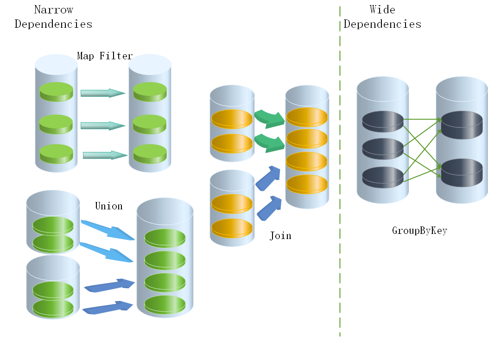
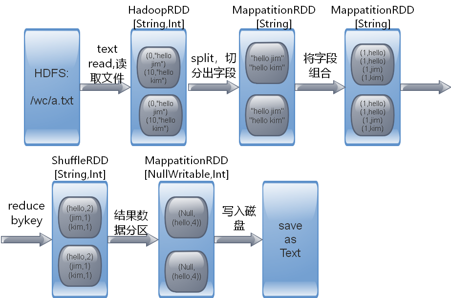

###RDD


1.1 安装spark集群:  
解压安装包到指定位置  
tar -zxvf spark-2.1.0-bin-hadoop2.6.tgz -C /usr/local  

1.2 配置spark：  
```bash
解压安装包到指定位置  
tar -zxvf spark-2.1.0-bin-hadoop2.6.tgz -C /usr/local  
在该配置文件中添加如下配置  
export JAVA_HOME=/usr/java/jdk1.8.0_111  
#export SPARK_MASTER_IP=node1.edu360.cn  
#export SPARK_MASTER_PORT=7077  
保存退出  
重命名并修改slaves.template文件  
mv slaves.template slaves  
vi slaves  
在该文件中添加子节点所在的位置（Worker节点）  
node2.edu360.cn  
node3.edu360.cn  
node4.edu360.cn  
保存退出
将配置好的Spark拷贝到其他节点上
scp -r spark-2.1.0-bin-hadoop2.6/ node2.edu360.cn:/usr/local/
scp -r spark-2.1.0-bin-hadoop2.6/ node3.edu360.cn:/usr/local/
scp -r spark-2.1.0-bin-hadoop2.6/ node4.edu360.cn:/usr/local/

Spark集群配置完毕，目前是1个Master，3个Work，在node1.edu360.cn上启动Spark集群
/usr/local/spark-2.1.0-bin-hadoop2.6/sbin/start-all.sh

启动后执行jps命令，主节点上有Master进程，其他子节点上有Work进行，登录Spark管理界面查看集群状态（主节点）：http://node1.edu360.cn:8080/
```

1.3 解决master单点问题：
```bash
Master节点存在单点故障，要解决此问题，就要借助zookeeper，并且启动至少两个Master节点来实现高可靠，配置方式比较简单：
Spark集群规划：node1，node2是Master；node3，node4，node5是Worker
安装配置zk集群，并启动zk集群
停止spark所有服务，修改配置文件spark-env.sh，在该配置文件中删掉SPARK_MASTER_IP并添加如下配置
export SPARK_DAEMON_JAVA_OPTS="-Dspark.deploy.recoveryMode=ZOOKEEPER -Dspark.deploy.zookeeper.url=zk1,zk2,zk3 -Dspark.deploy.zookeeper.dir=/spark"
1.在node1节点上修改slaves配置文件内容指定worker节点
2.在node1上执行sbin/start-all.sh脚本，然后在node2上执行sbin/start-master.sh启动第二个Master
```

1.4 执行spark程序:
```bash
/usr/local/spark-2.1.0-bin-hadoop2.6/bin/spark-submit \
--class org.apache.spark.examples.SparkPi \
--master spark://node1.edu360.cn:7077 \
--executor-memory 1G \
--total-executor-cores 2 \
/usr/local/spark-2.1.0-bin-hadoop2.6/lib/spark-examples-2.1.0-hadoop2.6.0.jar \
100
该算法是利用蒙特•卡罗算法求PI
```

1.5 启动spark shell：
```bash
/usr/local/spark-2.1.0-bin-hadoop2.6/bin/spark-shell \
--master spark://node1.edu360.cn:7077 \
--executor-memory 2g \
--total-executor-cores 2

参数：
--master spark://node1.edu360.cn:7077 指定Master的地址
--executor-memory 2g 指定每个worker可用内存为2G
--total-executor-cores 2 指定整个集群使用的cup核数为2个
```


2.1 spark与mapreduce：  
mapreduce：：基于MapReduce的计算引擎通常会将中间结果输出到磁盘上，进行存储和容错。出于任务管道承接的，考虑，当一些查询翻译到MapReduce任务时，往往会产生多个Stage，而这些串联的Stage又依赖于底层文件系统（如HDFS）来存储每一个Stage的输出结果。spark则将中间结果存入集群中的内存，再计算，最终存入hdfs或者磁盘上。所以spark比mapreduce要快的多。  

2.2 spark的高可用集群部署：  
借助zookeeper，将master，workerd的资源信息与资源使用情况存入zookeeper，让zookeeper监督master活跃情况，当master down掉后，zookeeper启动backup备用的master。


2.3 spark任务执行:    
Diver端产生运算逻辑，然后添加任务task给master，master端负责资源调度，即在哪些worker上启动进程。Master再通过RPC与worker通信，让worker启动executor以及分区数量确定。worker启动executor后，executor与driver连接，执行真正计算逻辑。


3.1 RDD  

* RDD:弹性分布式数据集（Resilient Distributed Dataset）:  
是Spark中最基本的数据抽象，它代表一个不可变、可分区、里面的元素可并行计算的集合。RDD具有数据流模型的特点：自动容错、位置感知性调度和可伸缩性。RDD允许用户在执行多个查询时显式地将工作集缓存在内存中，后续的查询能够重用工作集，这极大地提升了查询速度。

* RDD属性：  

```
1）一组分片（Partition），即数据集的基本组成单位。对于RDD来说，每个分片都会被一个计算任务处理，并决定并行计算的粒度。用户可以在创建RDD时指定RDD的分片个数，如果没有指定，那么就会采用默认值。默认值就是程序所分配到的CPU Core的数目。

2）一个计算每个分区的函数。Spark中RDD的计算是以分片为单位的，每个RDD都会实现compute函数以达到这个目的。compute函数会对迭代器进行复合，不需要保存每次计算的结果。

3）RDD之间的依赖关系。RDD的每次转换都会生成一个新的RDD，所以RDD之间就会形成类似于流水线一样的前后依赖关系。在部分分区数据丢失时，Spark可以通过这个依赖关系重新计算丢失的分区数据，而不是对RDD的所有分区进行重新计算。

4）一个Partitioner，即RDD的分片函数。当前Spark中实现了两种类型的分片函数，一个是基于哈希的HashPartitioner，另外一个是基于范围的RangePartitioner。只有对于于key-value的RDD，才会有Partitioner，非key-value的RDD的Parititioner的值是None。Partitioner函数不但决定了RDD本身的分片数量，也决定了parent RDD Shuffle输出时的分片数量。

5）一个列表，存储存取每个Partition的优先位置（preferred location）。对于一个HDFS文件来说，这个列表保存的就是每个Partition所在的块的位置。按照“移动数据不如移动计算”的理念，Spark在进行任务调度的时候，会尽可能地将计算任务分配到其所要处理数据块的存储位置。
```

* RDD的依赖关系:

窄依赖:  
窄依赖指的是每一个父RDD的Partition最多被子RDD的一个Partition使用


宽依赖:  
宽依赖指的是多个子RDD的Partition会依赖同一个父RDD的Partition




1.RDD是一个基本的抽象，操作RDD就像操作一个本地集合一样，降低了编程的复杂度
```
RDD的算子分为两类，一类是Transformation（lazy），一类是Action（触发任务执行）
RDD不存真正要计算的数据，而是记录了RDD的转换关系（调用了什么方法，传入什么函数）
RDD有5个特点  
	1.一系列分区  
	2.会有一个函数作用在每个切片上  
	3.RDD和RDD之间存在依赖关系  
	4（可选）如果是RDD中装的是KV类型的，那么Shuffle时会有一个分区器。默认是HashPartitioner   
	5（可选）如果只从HDFS中读取数据，会感知数据则位置，将Executor启动在数据所在的机器上  

Spark的设计就是基于这个抽象的数据集（RDD），你操作RDD这个抽象的数据集，就像操作一个本地集合一样，Spark包底层的细节都隐藏起来的（任务调度、Task执行，任务失败重试等待），开发者使用起来更加方便简洁，操作RDD，其实是对每个分区进行操作，分区会生成Task，Task会调度Executor上执行相关的计算逻辑，进而对数据进操作。
```

```
创建RDD方式  
	1.通过外部的存储系统创建RDD
	2.将Driver的Scala集合通过并行化的方式编程RDD（试验、测验）
	3.调用一个已经存在了的RDD的Transformation，会生成一个新的RDD

	RDD的Transformation的特点
	1.lazy
	2.生成新的RDD


RDD分区的数据取决因素   
	1.如果是将Driver端的Scala集合并行化创建RDD，并且没有指定RDD的分区，RDD的分区就是为该app分配的中的和核数
	2.如果是重hdfs中读取数据创建RDD，并且设置了最新分区数量是1，那么RDD的分区数据即使输入切片的数据，如果不设置最小分区的数量，即spark调用textFile时会默认传入2，那么RDD的分区数量会打于等于输入切片的数量

-------------------------------------------
RDD的map方法，是Executor中执行时，是一条一条的将数据拿出来处理


mapPartitionsWithIndex 一次拿出一个分区（分区中并没有数据，而是记录要读取哪些数据，真正生成的Task会读取多条数据），并且可以将分区的编号取出来

功能：取分区中对应的数据时，还可以将分区的编号取出来，这样就可以知道数据是属于哪个分区的（哪个区分对应的Task的数据）

	//该函数的功能是将对应分区中的数据取出来，并且带上分区编号
    val func = (index: Int, it: Iterator[Int]) => {
      it.map(e => s"part: $index, ele: $e")
    }

-------------------------------------------

aggregateByKey   是Transformation
reduceByKey      是Transformation
filter           是Transformation
flatMap			 是Transformation
map              是ransformation
mapPartition     是ransformation
mapPartitionWithIndex 是ransformation


collect          是Action
aggregate        是Action
saveAsTextFile   是Action
foreach          是Action
foreachPartition 是Action
```

* RDD缓存:  
Spark速度非常快的原因之一，就是在不同操作中可以在内存中持久化或缓存个数据集。当持久化某个RDD后，每一个节点都将把计算的分片结果保存在内存中，并在对此RDD或衍生出的RDD进行的其他动作中重用。这使得后续的动作变得更加迅速。RDD相关的持久化和缓存，是Spark最重要的特征之一。可以说，缓存是Spark构建迭代式算法和快速交互式查询的关键。RDD通过persist方法或cache方法可以将前面的计算结果缓存，但是并不是这两个方法被调用时立即缓存，而是触发后面的action时，该RDD将会被缓存在计算节点的内存中，并供后面重用。

* DAG的生成:  
DAG(Directed Acyclic Graph)叫做有向无环图，原始的RDD通过一系列的转换就就形成了DAG，根据RDD之间的依赖关系的不同将DAG划分成不同的Stage，对于窄依赖，partition的转换处理在Stage中完成计算。对于宽依赖，由于有Shuffle的存在，只能在parent RDD处理完成后，才能开始接下来的计算，因此宽依赖是划分Stage的依据。


* WordCount 过程分析:

```scala
object WordCount {
  def main(args: Array[String]): Unit = {
    //创建spark相关属性
    val conf: SparkConf = new SparkConf().setAppName(s"${this.getClass.getSimpleName}").setMaster("local[2]")
    val sc = new SparkContext(conf)
    //读取文件
    val lines = sc.textFile(args(0))
    //通过map处理数据
    val line = lines.map(x =>{
      val cont = x.split(",")
      val name = cont(0)
      val number = cont(1).toInt
      val price = cont(2).toDouble
      //将姓名作为key，剩余作为value形成元组
      (name,(number,price))
    })
    //通过reducebykey先分区聚合再全局聚合
    val re = line.reduceByKey((x,y) => (x._1+y._1,x._2+y._2))
  }

}
```



整个wordcount过程产生6个rdd:(1)读取文件产生rdd;(2)spilt分割产生mapRDD;(3)字段组合产生mapRDD;(4)reducebykey产生shuffleRDD;(5)结果再map形成(nullwritable,int)mapRDD;(6)写入磁盘或其他系统。整个过程有一个shuffle，有两个分区，故有4个task。

 *  DAG：  
 DAG为多个rdd的转换过程，任务执行时可以按照DAG的描述执行真正的计算。DAG有边界，有开始，通过sparkcontext创建rdd读取数据，有结束，触发action条用runjob就是一个完整的DAG。一个sparkapplication有一到多个DAG，取决于触发action多少次，一个DAG可能产生多种不同的task。


1,构建DAG，在driver端各种计算逻辑即为构建DAG；2，DAGschedule,将图分为多个stage，stage数量为shuffle数量，stage会产生task；3，将DAGschedule以task形式递给Taskschedule，用于准备执行任务，将其序列化，发给execoutor；4，executor接受任务后，反序列化，然后执行之。

DAG4个过程:  
1,构建DAG(Driver端)  
2,切分stage(Driver端)  
3,调度task(Driver端)  
4,执行task(Executor) 


总结
``` 

1.SparkContext哪一端生成的？
	Driver端

2.DAG是在哪一端被构建的？
    Driver端
    
3.RDD是在哪一端生成的？
	Driver端

4.广播变量是在哪一端调用的方法进行广播的？
	Driver端

5.要广播的数据应该在哪一端先创建好再广播呢？ 
	Driver端

6.调用RDD的算子（Transformation和Action）是在哪一端调用的
	Driver端
	
7.RDD在调用Transformation和Action时需要传入一个函数，函数是在哪一端声明和传入的?
	Driver端

6.RDD在调用Transformation和Action时需要传入函数，请问传入的函数是在哪一端执行了函数的业务逻辑？
	Executor中的Task执行的

7.自定义的分区器这个类是在哪一端实例化的？
	Driver端

8.分区器中的getParitition方法在哪一端调用的呢？
	Executor中的Task中调用的

9.Task是在哪一端生成的呢？ 
	Driver端

10.DAG是在哪一端构建好的并被切分成一到多个State的
	Driver端

11.DAG是哪个类完成的切分Stage的功能？
	DAGScheduler
	
12.DAGScheduler将切分好的Stage以什么样的形式给TaskScheduler
	TaskSet
```