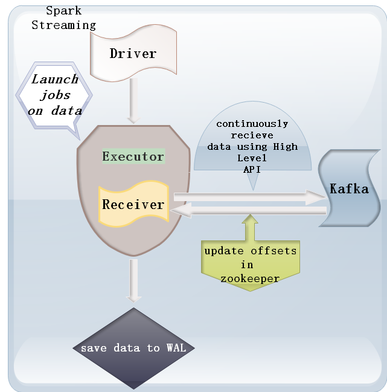
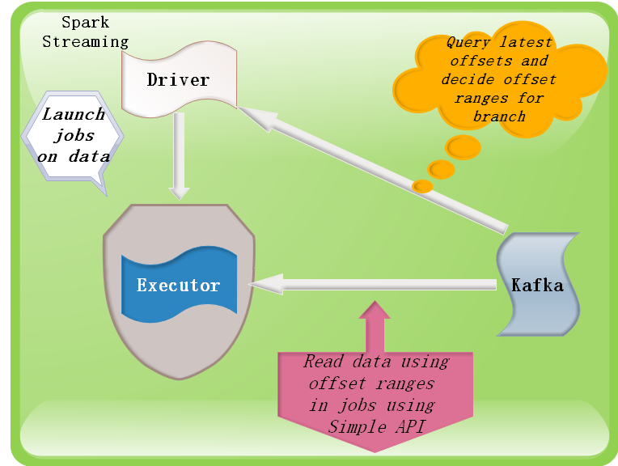

### spark整合kafka

实时计算相关技术

|Strom / JStrom|Spark Streming|Flink |
|---|----|-----|    
| 实时性高  |有延迟 |实时性高 |
| 吞吐量较低|吞吐量高|吞吐量高|
|只能实时计算|离线+实时|离线+实时|
|算子比较少|算子丰富|算子丰富|
|没有|机器学习|没有|
|没有|图计算|没有|
|使用比较少|非常火|一般|

一个完整的生态是非常重要的，spark生态特别完善


---------------------------------------------------------

Kafka的一些概念  
	Broker ： 安装Kafka服务的那台集群就是一个broker（broker的id要全局唯一）  
	Producer ：消息的生产者，负责将数据写入到broker中（push）  
	Consumer：消息的消费者，负责从kafka中读取数据（pull），老版本的消费者需要依赖zk，新版本的不需要  
	Topic: 主题，相当于是数据的一个分类，不同topic存放不同的数据  
	Consumer Group： 消费者组，一个topic可以有多个消费者同时消费，多个消费者如果在一个消费者组中，那么他们不能重复消费数据  

Spark Streaming 2.2.0兼容kafka 0.8.2.1以上的版本，主要支持0.8和0.10这两个版本

---------------------------------------------------------
kafka0.8集群安装
	1.下载Kafka安装包  
	2.上传安装包  
	3.解压  
	4.修改配置文件 config/server.properties  
		broker.id=0  
		host.name=node-4  
		log.dirs=/data/kafka  
		zookeeper.connect=node-1:2181,node-2:2181,node-3:2181  
	5.将配置好的kafka拷贝到其他机器上  
	6.修改broker.id和host.name  
	7.启动kafka  
		/bigdata/kafka_2.11-0.8.2.2/bin/kafka-server-start.sh -daemon /bigdata/kafka_2.11-0.8.2.2/config/server.properties   

```bash
	#查看topic信息
	/bigdata/kafka_2.11-0.8.2.2/bin/kafka-topics.sh --list --zookeeper node-1:2181,node-2:2181

	#创建topic
	/bigdata/kafka_2.11-0.8.2.2/bin/kafka-topics.sh --create --zookeeper node-1:2181,node-2:2181 --replication-factor 3 --partitions 3 --topic xiaoniu

	#往Kafka的topic中写入数据(命令行的生成者)
	/bigdata/kafka_2.11-0.8.2.2/bin/kafka-console-producer.sh --broker-list node-4:9092,node-5:9092,node-5:9092 --topic xiaoniu

	#启动消费者
	/bigdata/kafka_2.11-0.8.2.2/bin/kafka-console-consumer.sh --zookeeper node-1:2181,node-2:2181 --topic xiaoniu --from-beginning
```
----

```
kafka1.0集群部署

broker.id=1
delete.topic.enable=true
log.dirs=/bigdata/kafka_2.11-0.10.2.1/data
zookeeper.connect=node-1.xiaoniu.com:2181,node-2.xiaoniu.com:2181,node-3.xiaoniu.com:2181

启动kafka
/bigdata/kafka_2.11-0.10.2.1/bin/kafka-server-start.sh -daemon /bigdata/kafka_2.11-0.10.2.1/config/server.properties 

停止kafka
/bigdata/kafka_2.11-0.10.2.1/bin/kafka-server-stop.sh 


创建topic
/bigdata/kafka_2.11-0.10.2.1/bin/kafka-topics.sh --create --zookeeper node-1.xiaoniu.com:2181,node-2.xiaoniu.com:2181,node-3.xiaoniu.com:2181 --replication-factor 3 --partitions 3 --topic my-topic


列出所有topic
/bigdata/kafka_2.11-0.10.2.1/bin/kafka-topics.sh --list --zookeeper node-1.xiaoniu.com:2181,node-2.xiaoniu.com:2181,node-3.xiaoniu.com:2181

查看某个topic信息
/bigdata/kafka_2.11-0.10.2.1/bin/kafka-topics.sh --describe --zookeeper node-1.xiaoniu.com:2181,node-2.xiaoniu.com:2181,node-3.xiaoniu.com:2181 --topic my-topic

启动一个命令行的生产者
/bigdata/kafka_2.11-0.10.2.1/bin/kafka-console-producer.sh --broker-list node-1.xiaoniu.com:9092,node-1.xiaoniu.xom:9092,node-3.xiaoniu.com:9092 --topic xiaoniu

启动一个命令行的消费者
/bigdata/kafka_2.11-0.10.2.1/bin/kafka-console-consumer.sh --zookeeper node-1.xiaoniu.com:2181,node-2.xiaoniu.com:2181,node-3.xiaoniu.com:2181 --topic my-topic --from-beginning

# 消费者连接到borker的地址
/bigdata/kafka_2.11-0.10.2.1/bin/kafka-console-consumer.sh --bootstrap-server node-1.xiaoniu.com:9092,node-2.xiaoniu.com:9092,node-3.xiaoniu.com:9092 --topic xiaoniu --from-beginning 
```

kafka直连与receiver两种方式的区别


receiver方式，  

Receiver是使用Kafka的高层次Consumer API来实现的。Receiver接收固定时间间隔的数据（放在内存中的），使用高级API，自动维护偏移量，达到固定的时间才去进行处理，效率低并且容易丢失数据，灵活性特别差，不好，而且它处理数据的时候，如果某一刻的数据量过大，那么就会造成磁盘溢写的情况，他通过WALS进行磁盘写入。receiver从Kafka中获取的数据都是存储在Spark Executor的内存中的，然后Spark Streaming启动的job会去处理那些数据。然而，在默认的配置下，这种方式可能会因为底层的失败而丢失数据。如果要启用高可靠机制，让数据零丢失，就必须启用Spark Streaming的预写日志机制（Write Ahead Log，WAL）。该机制会同步地将接收到的Kafka数据写入分布式文件系统（比如HDFS）上的预写日志中。所以，即使底层节点出现了失败，也可以使用预写日志中的数据进行恢复，但是效率会下降。



   
Direct直连方式，  

Direct方式采用Kafka简单的consumer api方式来读取数据，无需经由ZooKeeper，此种方式不再需要专门Receiver来持续不断读取数据。当batch任务触发时，由Executor读取数据，并参与到其他Executor的数据计算过程中去。driver来决定读取多少offsets，并将offsets交由checkpoints来维护。将触发下次batch任务，再由Executor读取Kafka数据并计算。从此过程我们可以发现Direct方式无需Receiver读取数据，而是需要计算时再读取数据，所以Direct方式的数据消费对内存的要求不高，只需要考虑批量计算所需要的内存即可；另外batch任务堆积时，也不会影响数据堆积。它使用的是底层API实现Offest我们开发人员管理，这样的话，它的灵活性特别好。并且可以保证数据的安全性，而且不用担心数据量过大，因为它有预处理机制，进行提前处理，然后再批次提交任务。direct 这种方式会周期性地查询Kafka，来获得每个topic+partition的最新的offset，从而定义每个batch的offset的范围。当处理数据的job启动时，就会使用Kafka的简单consumer api来获取Kafka指定offset范围的数据。这种方式有如下优点：




1、简化并行读取：如果要读取多个partition，不需要创建多个输入DStream然后对它们进行union操作。Spark会创建跟Kafka partition一样多的RDD partition，并且会并行从Kafka中读取数据。所以在Kafka partition和RDD partition之间，有一个一对一的映射关系。  


2、高性能：如果要保证零数据丢失，在基于receiver的方式中，需要开启WAL机制。这种方式其实效率低下，因为数据实际上被复制了两份，Kafka自己本身就有高可靠的机制，会对数据复制一份，而这里又会复制一份到WAL中。而基于direct的方式，不依赖Receiver，不需要开启WAL机制，只要Kafka中作了数据的复制，那么就可以通过Kafka的副本进行恢复。  


3、一次且仅一次的事务机制：  
    基于receiver的方式，是使用Kafka的高阶API来在ZooKeeper中保存消费过的offset的。这是消费Kafka数据的传统方式。这种方式配合着WAL机制可以保证数据零丢失的高可靠性，但是却无法保证数据被处理一次且仅一次，可能会处理两次。因为Spark和ZooKeeper之间可能是不同步的。
    基于direct的方式，使用kafka的简单api，Spark Streaming自己就负责追踪消费的offset，并保存在checkpoint中。Spark自己一定是同步的，因此可以保证数据是消费一次且仅消费一次。


