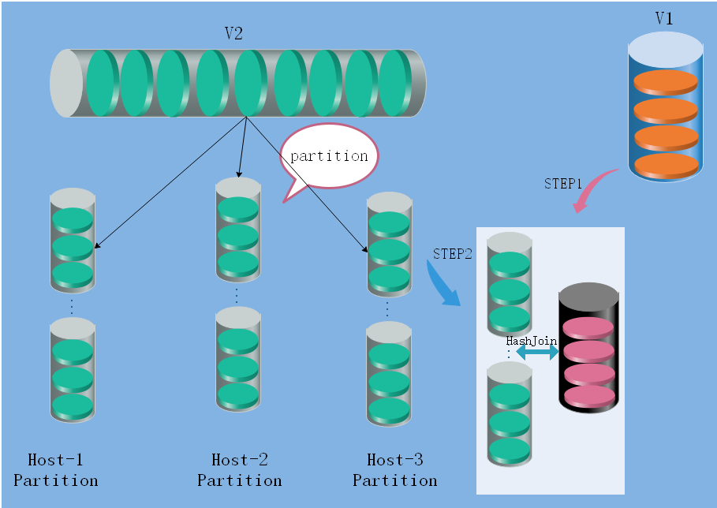

###JOIN

* sparkSQL join 有四种方式:Hash Join,broadcast hash Join,shuffle hash Join,sort merge join

* Hash Join:  
SQL:select * from v1 join v2 on v1.name = v2.name;  
sparkSQL为从表v1与v2join的结果中获得所有信息在name一样时。整个join过程分为三个阶段.

----

1. 确定build table(映射表，小表)以及probe table(探查表，大表)。其中，buildtable会用于构建hashtable,而probetable会遍历自身所有key，映射到hashtable上去匹配。  

2. Build Table构建Hash Table。依次读取Build Table（v1）的数据，对于每一行数据根据join key（v1.name）进行hash，hash到对应的Bucket，生成hash table中的一条记录。数据缓存在内存中，如果内存放不下需要dump到外存。当hash值相等时，会以链表的形式在value后面链接上。  

3. Probe Table探测。依次扫描Probe Table（v2）的数据，使用相同的hash函数映射Hash Table中的记录，映射成功之后再检查join条件（v1.name = v2.name），如果匹配成功就可以将两者join在一起。

4. hashjoin要对两张表全部扫描一次，算法效率为O(a+b),比笛卡尔积算法的a*b快了很多数量级。

5. Build Table要尽量选择小表.从原理上讲，构建的Hash Table是需要被频繁访问的，所以Hash Table最好能全部加载到内存里，速度才会块，这也决定了hash join只适合至少一个小表join的场景。  

* Broadcast Hash Join：  

broadcast hash join是将其中一张小表广播分发到另一张大表所在的分区节点上，分别并发地与其上的分区记录进行hash join。broadcast适用于小表很小，可以直接广播的场景。
在执行上，主要可以分为以下两步：  

1. broadcast阶段：将小表广播分发到大表所在的所有主机。分发方式可以有driver分发，或者采用p2p方式。 

2. hash join阶段：在每个executor上执行单机版hash join，小表映射，大表试探；需要注意的是，Spark中对于可以广播的小表，默认限制是10M以下。（参数是spark.sql.autoBroadcastJoinThreshold）  

----

* Shuffle Hash Join:  

当join的一张表很小的时候，使用broadcast hash join，无疑效率最高。但是随着小表逐渐变大，广播所需内存、带宽等资源必然就会太大，所以才会有默认10M的资源限制。所以，当小表逐渐变大时，就需要采用另一种Hash Join来处理：Shuffle Hash Join。Shuffle Hash Join按照join key进行分区，根据key相同必然分区相同的原理，将大表join分而治之，划分为小表的join，充分利用集群资源并行化执行。在执行上，主要可以分为以下两步：  
1. shuffle阶段：分别将两个表按照join key进行分区，将相同join key的记录重分布到同一节点，两张表的数据会被重分布到集群中所有节点。  
2. hash join阶段：每个分区节点上的数据单独执行单机hash join算法。  

----

* Sort-Merge Join: 
 
SparkSQL对两张大表join采用了全新的算法－sort-merge join，整个过程分为4个步骤：  
1. shuffle阶段：将两张大表根据join key进行重新分区，两张表数据会分布到整个集群，以便分布式并行处理  
2. sort阶段：对单个分区节点的两表数据，分别进行排序  
3. merge阶段：对排好序的两张分区表数据执行join操作。join操作很简单，分别遍历两个有序序列，碰到相同join key就merge输出，否则继续取更小一边的key。    
4. sort-merge join的代价并不比shuffle hash join小，反而是多了很多。目前spark的shuffle实现都适用sort-based shuffle算法，因此在经过shuffle之后partition数据都是按照key排序的。因此理论上可以认为数据经过shuffle之后是不需要sort的，可以直接merge。

